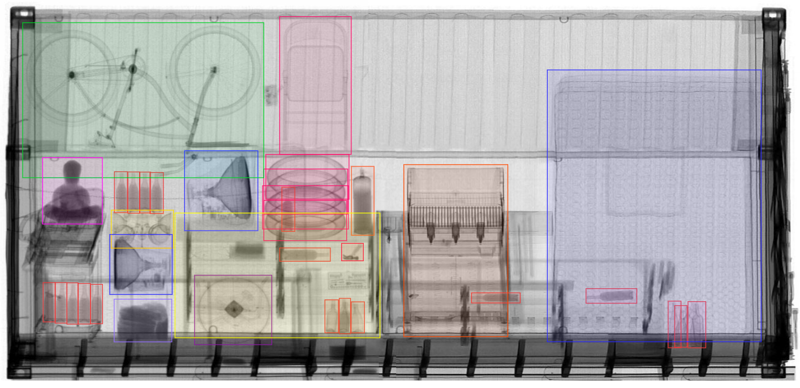
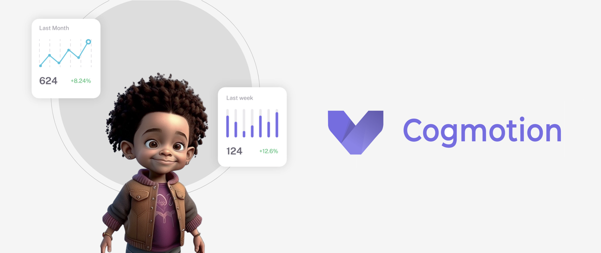
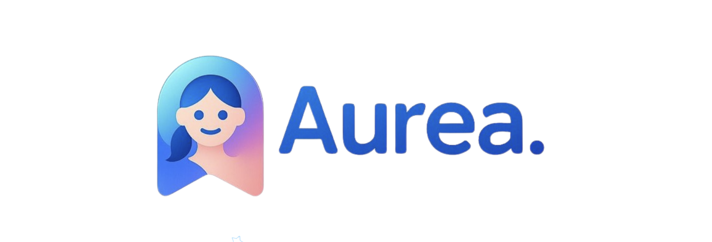

# DADOS INSTITUCIONAIS

## 1. Introdução
A Cogmo Technology é uma startup de IA e ML que alia rigor técnico, experimentação responsável e foco em ROI. Equipe com experiência em visão computacional, NLP e agentes conversacionais.

## 2. Reconhecimentos e Premiações
Vitória no Ocean Code Hackathon (SBM Offshore + Fábrica de Startups) como marco inicial, validando excelência técnica em IA aplicada.

## 3. Projetos Emblemáticos
Rust Hunter, Previsão de Enchentes, Cogmotion e Tutor.AI.

## 4. Metodologias e Boas Práticas
Gestão Ágil e Lean, PD&I, TRL e obsessão por escalabilidade com custos sob controle.

## 5. Capacidades da Equipe
Visão computacional, NLP, LLMs, analytics preditivo, PMP em projetos complexos.

## 6. Conclusão
Da prova de conceito à operação: do laboratório à entrega.

# Bot de Cobrança via WhatsApp com IA

## Resumo
Agente de WhatsApp que reduz inadimplência com conversas empáticas, link de pagamento no chat e escalonamento humano quando necessário.

## Contexto e Problema
Mensalidades e assinaturas sofrem com atrasos por fricção de pagamento e esquecimentos. A cobrança manual eleva custos e desgasta o relacionamento.

## Solução
Agente automatizado com linguagem natural (LLMs), alternativas pragmáticas (ajuste/pausa) e respeito às políticas institucionais.

## Estratégia (como opera)
Canal certo, conversa que resolve, humano quando soma, aprendizado contínuo.

## Valor Gerado (resultados esperados)
Aumento de recuperação, redução de custos, agilidade e melhor experiência.

## Métricas que importam
Recuperação incremental vs. controle, custo por valor recuperado, tempo até regularização e satisfação.

# Sistema de IA para Triagem de Cargas — Receita Federal

## Resumo
Plataforma que cruza o declarado com imagens (raio‑foto), aponta divergências e prioriza risco para reduzir filas, aumentar achados e proteger receita.

# Cogmotion — Monitoramento Escolar com IA (em sala)

## Resumo
Transforma vídeo e áudio em indicadores de segurança e convivência, com alertas configuráveis e governança LGPD.

# Aurea — Consultoria Virtual de Moda (WhatsApp‑first)

## Resumo
Concierge conversacional que aplica métodos acadêmicos + IA para colorimetria, caimento, estilo e virtual try‑on.

# Peqii — Agente Conversacional de Presentes Corporativos

## Resumo
Atendimento consultivo 1:1 no WhatsApp para compor kits, personalizar e fechar propostas em minutos, com transparência de preços.

# Sistema de IA para Previsão de Enchentes — Itajaí‑çu (Blumenau)
## Resumo
Modelo profundo para prever níveis do rio 6–8h antes com alta precisão, apoiando Defesa Civil.

