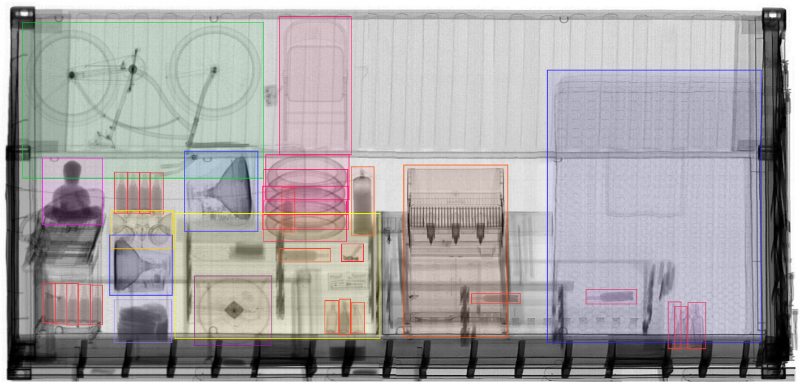
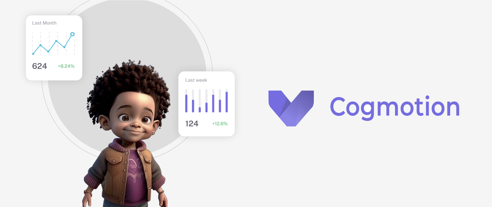

# Bot de Cobrança via WhatsApp com IA
## Resumo
**Desafio:** inadimplência recorrente elevando custo operacional e afetando a relação com membros.

**Solução:** agente de WhatsApp com IA que conversa de forma empática, reenvia meios de pagamento no chat, oferece alternativas (ajuste/pausa) e aciona humano apenas quando necessário.

**Valor gerado:** mais regularizações, menor custo por contato, queda no tempo até o pagamento e melhor experiência do filiado.

**Como medimos:** piloto com grupo de controle, acompanhando recuperação incremental, custo por valor recuperado, tempo até regularização e satisfação pós-contato.
## Contexto e Problema

Organizações com receitas recorrentes (mensalidades/assinaturas) convivem com inadimplência por esquecimento, fricção de pagamento ou restrições momentâneas. A cobrança tradicional consome tempo de equipes, eleva o custo por contato e pode desgastar o relacionamento — afetando não só a receita do mês, mas também a retenção no longo prazo.

## Solução

Implementação de um **agente automatizado de cobrança via WhatsApp** que conduz conversas **empáticas e orientadas à resolução**, com linguagem natural (LLMs) e **encaminhamento humano** apenas quando necessário (negociação sensível, reclamação ou caso técnico). O agente reduz passos até o pagamento (link/2ª via no chat), oferece **alternativas pragmáticas** (ajuste de data/valor, pausa temporária) e respeita políticas de comunicação da instituição.

## Estratégia (como opera)

* **Canal certo, na hora certa:** mensagens objetivas e oportunas, diminuindo barreiras para pagar.
* **Conversa que resolve:** identificação do motivo do atraso e proposta do próximo passo sem atritos.
* **Humano quando soma valor:** triagem automática e critérios claros de escalonamento.
* **Medição e aprendizado contínuos:** testes controlados de mensagens e horários, com ajustes por segmento.

## Valor Gerado (resultados esperados)

* **Aumento da recuperação**: mais regularizações ao atuar no canal de maior resposta e com jornada curta.
* **Redução de custos**: automação do primeiro nível libera o time para casos que realmente pedem negociação.
* **Agilidade**: queda do tempo médio até a regularização, com fluxos 24/7 e reenvio imediato de meios de pagamento.
* **Retenção e reputação**: tratamento respeitoso e opções de flexibilização mantêm o vínculo do membro.

## Métricas que importam

* Recuperação **incremental** vs. controle (R\$ e %).
* **Custo por valor recuperado**.
* **Tempo até a regularização**.
* Conversão por **cenário** (ex.: boleto/cartão, faixas de atraso).
* **% de escalonamentos úteis** e satisfação pós-contato.

## Implantação (sem tecnicismos)

1. **Descoberta**: mensagens-alvo, políticas de escalonamento e cadência.
2. **Piloto controlado**: comparar com grupo de controle, medir KPIs e ajustar.
3. **Escala**: expandir segmentos com base no que funcionou melhor.

## Riscos & mitigação

* **Dados de contato desatualizados** → higienização contínua.
* **Excesso de mensagens** → cadência e opt-out claros.
* **Casos sensíveis** → critérios de escalonamento e treinamento do time humano.

**Em uma frase:** recuperar receita com **menos atrito e menor custo**, preservando relacionamento e previsibilidade de caixa.

    

# Sistema de IA para Triagem de Cargas — Receita Federal

## resumo

**Desafio:** filas de caminhões e gargalos na inspeção; necessidade de **enxergar rapidamente o que importa** para combater **tráfico de drogas e pessoas**, **contrabando**, **sonegação** e **declarações divergentes** — mantendo a operação fluida e auditável.

**Solução:** plataforma de IA que cruza o **declarado** com o **observado nas imagens** (raio‑X/foto), aponta **divergências e semelhanças** relevantes e **prioriza** cargas com maior probabilidade de risco, **aprendendo continuamente** com as decisões dos analistas.

**Valor gerado:** **redução de filas** e do **tempo de permanência** de veículos, **mais acertos em apreensões** (foco em cargas suspeitas), **menos inspeções físicas sem achado**, **proteção de receita** e **trilha de auditoria** para conformidade e responsabilização.

**Como medimos:** **tempo de fila** e **tempo por análise**; **declarações/contêineres por hora**; **taxa de priorização correta** (achados vs. inspeções); **índice de apreensões relevantes**; **redução de inspeções sem achado**; **desvio entre declarado e observado** por rota/operador.

---

## Contexto e Problema

Portos e demais pontos de recebimento (EADIs, pátios rodoviários, centros de triagem) enfrentam **picos de demanda** e alto volume de imagens. Sem apoio inteligente, cresce o **tempo de fila**, a equipe se dispersa em casos triviais e **inspeções físicas** sem achado consomem recursos que deveriam estar focados no **crime organizado** e em **fraudes que afetam a arrecadação**.

## Solução

Uma plataforma que:

* **Confirma e compara**: confronta a declaração com o conteúdo aparente das imagens e evidencia **incongruências**.
* **Foca onde há risco**: prioriza alvos com **maior probabilidade de delito** (tráfico, contrabando, subfaturamento, divergência de NCM/peso/volume).
* **Aprende com a operação**: melhora com o **feedback** de cada inspeção, fortalecendo o direcionamento de risco.
* **Integra-se à rotina**: opera junto aos sistemas existentes, respeitando políticas e **requisitos regulatórios**.

## Estratégia (como opera)

* **Cobertura ampla + especialização**: reconhece grande variedade de objetos/materiais e aprofunda o olhar nas categorias de **alto interesse fiscal/penal**.
* **Priorização de risco**: destaca rapidamente os contêineres/volumes que **merecem inspeção** e libera o fluxo dos demais.
* **Apoio à decisão**: apresenta contexto (declaração, histórico, rotas, casos semelhantes) para acelerar a **ação informada**.
* **Evolução contínua**: a cada ciclo, ajusta prioridades com base em **achados reais** e padrões emergentes.

## Valor Gerado (resultados esperados)

* **Descongestionamento**: queda do tempo de fila e aumento de throughput sem expandir equipe.
* **Maior efetividade**: **mais apreensões relevantes** por inspeção realizada e **menos falsos positivos**.
* **Proteção de receita**: melhor identificação de **subfaturamento** e **classificações indevidas**.
* **Previsibilidade e segurança**: respostas em **segundos** e trilha de auditoria que sustenta **transparência** e **responsabilização**.

## Métricas que importam

* **Tempo de fila** e **tempo por análise** (alvo: segundos por contêiner/volume).
* **Produtividade**: declarações/contêineres analisados por hora por analista.
* **Taxa de priorização correta** (achados vs. inspeções realizadas).
* **Índice de apreensões relevantes** e **redução de inspeções sem achado**.
* **Desvio declarado vs. observado** por rota/operador e **impacto na arrecadação**.

## Implantação (sem tecnicismos)

1. **Diagnóstico rápido**: medir filas atuais, volumes e indicadores de achado.
2. **Piloto direcionado**: começar por rotas/operadores de maior risco, medir resultados e ajustar.
3. **Escala**: expandir cobertura, integrar dados operacionais e padronizar rotinas de avaliação.

## Riscos & mitigação

* **Qualidade de dados variável** → diretrizes simples de captura e validação mínima antes da análise.
* **Mudança de modus operandi** → monitoramento contínuo e revisão de critérios de risco.
* **Exigências regulatórias** → **trilha de auditoria** e revisão humana para casos sensíveis.

**Em uma frase:** **reduzir filas e aumentar apreensões relevantes**, protegendo a arrecadação e o fluxo do comércio com uma triagem inteligente que coloca a equipe **exatamente onde o risco está**.

    

# Cogmotion — Monitoramento Escolar com IA (em sala)

## resumo

**Desafio:** professores e equipes de gestão precisam agir rápido diante de incidentes e, ao mesmo tempo, acompanhar sinais de bem‑estar dos alunos — tarefa difícil com salas cheias, múltiplos espaços e informação dispersa.

**Solução:** plataforma que transforma **vídeo e áudio** em informação útil: acompanha **presença e movimentação**, identifica **sinais de risco** (ex.: agressões, armas, incêndio), monitora **nível de barulho**, **gritos/choros** e **palavras ofensivas**, e calcula **índices de proximidade social**, com dashboards, comparativos e relatórios para apoiar decisões.

**Valor gerado:** **resposta mais rápida** a situações críticas, **prevenção** (bullying/segurança), **apoio pedagógico** com indicadores objetivos, **comunicação melhor** com responsáveis e **conformidade** (LGPD) com trilha de auditoria.

**Como medimos:** tempo de resposta a incidentes, assertividade dos alertas (precisão/falsos positivos), presença confirmada, evolução de indicadores de convivência por turma/sala/escola, satisfação de docentes e responsáveis.

*Nota:* projeto concebido junto à Secretaria de Educação do DF e à Prefeitura de Balneário Camboriú, com estudo jurídico favorável quanto à aderência à LGPD; houve também diálogo para, quando autorizado, alimentar fluxos do Conselho Tutelar e de programas que acompanham a qualidade de vida das crianças.

---

## Contexto e Problema

A observação individual é limitada para ambientes com muitas crianças e múltiplos espaços. Mudanças sutis de comportamento e interações passam despercebidas, e incidentes podem escalar antes de alguém perceber. Falta um **painel único** que reúna sinais de segurança e convivência para decisões rápidas e baseadas em evidências.

## Solução

O **Cogmotion** usa IA para transformar captações de **vídeo e áudio** em indicadores acionáveis:

* **Identidade e acesso (opcional):** presença e controle de entrada/saída com regras alinhadas à escola e LGPD.
* **Bem‑estar e convivência:** movimentação, interação entre alunos e **índice de proximidade social**.
* **Segurança:** detecção de **agressões**, **armas/faca**, **incêndio** e **riscos noturnos**.
* **Ambiente sonoro:** **nível de barulho**, **gritos/choros** e **palavras ofensivas**.
* **Painéis e relatórios:** detecção de anomalias, comparativos (entre alunos, salas, escolas, no tempo) e histórico para acompanhamento e ações pedagógicas.

## Estratégia (como opera)

* **Alertas configuráveis:** a escola define o que é alerta e como agir (fluxos de resposta e quem notificar).
* **Prioridade ao valor educacional:** insights para **prevenção** e **apoio**, não para punição automática.
* **Supervisão humana sempre:** profissionais validam alertas sensíveis antes de qualquer medida disciplinar.
* **Privacidade por padrão:** criptografia, minimização de dados, perfis não identificáveis quando possível e governança LGPD, amparada por estudo jurídico de aderência realizado nos pilotos com órgãos públicos.
* **Evolução contínua:** o sistema aprende com feedback da equipe, ajustando sensibilidade e relevância dos alertas.

## Valor Gerado (resultados esperados)

* **Segurança proativa:** redução do tempo entre ocorrência e intervenção.
* **Clima escolar melhor:** indicadores objetivos para tratar **bullying** e conflitos.
* **Tempo de ensino preservado:** menos interrupções por ruído e incidentes, mais foco em sala.
* **Transparência e diálogo:** registros claros para conversas com famílias e órgãos responsáveis.
* **Eficiência de gestão:** comparativos entre salas/turnos/escolas para priorizar recursos e ações.

## Métricas que importam

* **Tempo de resposta** a incidentes e taxa de incidentes recorrentes.
* **Precisão dos alertas** e **falsos positivos**.
* **Taxa de presença confirmada** e **aderência a rotinas** (entrada, saída, recreio).
* **Evolução de indicadores de convivência** (ex.: proximidade social, episódios de linguagem ofensiva).
* **Satisfação** de docentes e responsáveis.

## Implantação (sem tecnicismos)

1. **Diagnóstico e política:** objetivos pedagógicos, protocolo de resposta e diretrizes LGPD; formalização jurídica (à luz de parecer já obtido em pilotos com a Secretaria de Educação do DF e a Prefeitura de Balneário Camboriú) e pactos de dados com o Conselho Tutelar/programas de proteção, quando aplicável.
2. **Piloto em área limitada:** calibrar alertas e revisar impactos com a equipe escolar.
3. **Escala com governança:** expandir para mais salas/campi, formalizar rotinas e treinar equipes.

## Riscos & mitigação

* **Privacidade e aceitação:** comunicação transparente, consentimento quando aplicável, controles de acesso e auditoria.
* **Falsos positivos/viés:** thresholds ajustáveis, amostras diversas e revisão humana.
* **Dependência tecnológica:** redundância de captura e procedimentos manuais de contingência.

**Em uma frase:** **mais segurança e bem‑estar com dados**, para que a escola intervenha cedo, priorize recursos e preserve tempo de aprendizagem.

    

# Aurea — Consultoria Virtual de Moda, Imagem e Bem‑Estar (WhatsApp‑first)
## resumo

**Desafio:** consultoria de imagem tradicional é cara e síncrona; no e‑commerce, recomendações são genéricas e ignoram nuances de **estilo, cor e caimento** — reduzindo conversão e elevando trocas.
**Solução:** **Aurea**, um concierge conversacional no WhatsApp que aplica **métodos de estado da arte e acadêmicos** (adaptados à IA) para **democratizar** um conhecimento antes restrito a especialistas: coloração pessoal, biotipo/caimento, diagnóstico de estilo e **virtual try‑on** para experimentar combinações de peças.
**Valor gerado:** **orientação personalizada em minutos**, maior **confiança de compra**, **menos devoluções**, aumento de **ticket/conversão** e **experiência inclusiva** (linguagem empática e sem julgamentos).
**Como medimos:** conversão e ticket médio das sessões atendidas; redução de trocas/devoluções; tempo até o “look pronto”; CSAT/NPS; engajamento no WhatsApp; impacto por campanha/coleção.

---

## Contexto e Problema

A curadoria humana é qualificada, mas **pouco escalável**. Já no varejo digital, recomendações genéricas **não refletem** coloração, estilo de vida e preferências reais — abrindo espaço para **decisões inseguras**, carrinhos abandonados e **devoluções**. Startups que unem **IA + expertise acadêmica** têm a chance de **levar consultoria de imagem a qualquer pessoa**, no canal que ela já usa.

## Solução

A **Aurea** é um **sistema multiagente** que conduz do onboarding aos **looks prontos**, com tom humano e inclusivo:

* **Colorimetria**: guia de foto, análise automatizada e **paleta com temperatura/contraste**.
* **Biótipo e caimento**: medições assistidas e recomendações de modelagens que valorizam o corpo.
* **Estilo**: diagnóstico leve (Essência/Momentos) e dossiê resumido.
* **Virtual try‑on**: teste de combinações **direto no WhatsApp** (planos pagos), apoiando prova social e decisão.
* **Catálogo do varejo**: conexão com SKUs para looks shoppables.
*

## Estratégia (como opera)

* **WhatsApp‑first**: poucas bolhas, frases curtas e perguntas únicas para **entregar valor rápido**.
* **Métodos acadêmicos + IA de ponta**: protocolos de coloração, antropometria e teoria de estilo traduzidos em **experiências simples**; modelos generativos e de similaridade suportam try‑on e recomendações.
* **Guard‑rails conversacionais**: linguagem inclusiva, validação emocional e **zero julgamentos**.
* **Personalização contínua**: preferências (cores amadas/evitadas), ocasiões, peças‑base, restrições e orçamento **alimentam as sugestões**; estado salvo entre sessões.

## Valor Gerado (resultados esperados)

* **Conversão e ticket maiores**: confiança para finalizar o look completo.
* **Menos trocas**: escolha mais assertiva de **cor/caimento/tamanho**.
* **Velocidade**: do onboarding ao look pronto em **minutos**.
* **Experiência de marca**: consultoria 1:1, empática e acessível a qualquer cliente.
* **Dados acionáveis**: aprendizados por coleção/segmento para feed de merchandising e CRM.

## Métricas que importam

* **Taxa de conversão** e **ticket médio** em sessões atendidas.
* **% de devoluções/trocas** pós‑Aurea.
* **Tempo até o look pronto** (T2O).
* **CSAT/NPS** e retenção de usuários.
* **Uso do try‑on** (freq./impacto em conversão) e **aderência à paleta/estilo**.

## Implantação (sem tecnicismos)

1. **Kickoff com o varejo**: catálogo/SKUs, guias de tamanho e políticas de troca.
2. **Piloto controlado** (coleção/segmento): medir conversão, trocas e CSAT vs. controle.
3. **Escala**: expandir categorias, enriquecer prompts/estilos e integrar a campanhas e CRM.

## Riscos & mitigação

* **Acurácia de cor/caimento** → guia de captura de foto, calibração por marca/tecido e feedback de troca.
* **Aceitação do try‑on** → educação visual, exemplos e prova social.
* **Privacidade/confiança** → consentimento claro, retenção mínima e opção de exclusão.

**Em uma frase:** **consultoria de imagem para todos**, unindo **métodos acadêmicos** e **IA de última geração** para transformar dúvida em **decisão com estilo** — no WhatsApp.

    

# Peqii — Agente Conversacional de Presentes Corporativos (WhatsApp‑first)

## resumo

**Desafio:** escolher e operacionalizar **presentes corporativos realmente memoráveis** é trabalhoso: briefings incompletos, catálogos extensos, prazos apertados, personalização limitada e logística complexa — tudo isso reduz conversão e eleva retrabalho.

**Solução:** agente de IA no WhatsApp que conduz um **atendimento consultivo 1:1**, com **memória de preferências** (ocasiões, linguagem de marca, itens amados/evitados) e aplicação de **métodos de estado da arte e acadêmicos** traduzidos para uma experiência simples. Entende **objetivo, público, orçamento e tom da marca** e oferece **combinações personalizadas** (itens + embalagem + mensagem), com **visual prévio/try‑on** quando cabível. **Não inventa preços**: trabalha com base real e confirma condições antes da proposta.

**Valor gerado:** **briefing rápido e completo**, **recomendações altamente personalizadas** e **propostas assertivas em minutos**; maior **taxa de fechamento** e **ticket** (bundles/upsell), **menos devoluções** e logística simplificada (end‑to‑end: recomendação → customização → compra → entrega). O **aprendizado contínuo** por conta/projeto melhora cada nova rodada.

**Como medimos:** lead→proposta, proposta→fechamento, **tempo até proposta**, **ticket médio**, índice de personalização (camadas por kit), **taxa de aprovação em 1 toque**, **OTD** (on‑time delivery) e **feedback do presenteado** (nota/comentários) para fechar o ciclo de ROI.

---

## Contexto e Problema

Programas de engajamento e relacionamento dependem de presentes que **representem a marca** e **falem com o receptor** (funcionários ou clientes). Na prática, as equipes enfrentam **decisão por exaustão** (muitas opções), **briefings incompletos**, prazos curtos, fornecedores dispersos e **baixa personalização**, o que resulta em **conversão baixa** e **experiências genéricas**.

## Solução

**Peqii** é um agente conversacional com memória de **catálogo e repertório de combinações**. Ele:

* **Levanta requisitos** em linguagem simples (uma pergunta por vez), captura **objetivos da ação** (onboarding, reconhecimento, ABM, datas sazonais), **perfil do público** e **restrições** (políticas, logística, sustentabilidade).
* **Propõe kits nomeados** (ex.: "Kit Bem‑vindo"), **sempre listando os itens**, variações de cor/tamanho e **mensagem personalizada** alinhada à marca.
* **Orquestra personalização** (gravação/estampa/packaging/cartão) e **aprovação** do solicitante com **visual prévio** (try‑on de artes/layouts via WhatsApp quando aplicável).
* **Garante transparência**: **não revela valores especulativos** e só avança com base de preços válida e condições confirmadas.
* **Pós‑entrega e aprendizado**: **coleta feedback dos presenteados** e registra o que funcionou para fortalecer as próximas ações.
* Gera **resumo de RFQ** para confirmação e avança para proposta/fechamento, com **handoff humano** quando necessário (itens fora de catálogo, condições especiais).
* **End‑to‑end**: coordena **compra e entrega** (endereços únicos ou múltiplos) e acompanha status.

> Startup em tração impulsionada pela Cogmo; já atraiu interesse de **players conhecidos do varejo** e de áreas de people/marketing de grandes contas, possuindo em sua carteira de clientes empresas como: Itaú, Subway, Magazine Luiza, C\&A, Loft e Bain & Company

## Estratégia em IA (como opera)

* **Conversão consultiva:** diagnóstico breve → proposta curada → fechamento simples.
* **Personalização radical:** compõe kits a partir de **estilo/ocasião/valores da marca**; sugere **mensagens** que reforçam o propósito.
* **Good/Better/Best:** 3 níveis de kit para **ancoragem de valor**.
* **Memória de preferências:** lembra aprendizados por **conta e projeto** (itens proibidos, tons/temas, linguagem, restrições).
* **Transparência e confiança:** trabalha com **preços e prazos validados**; apresenta alternativas quando há risco de estoque/prazo.
* **Lembretes inteligentes:** follow‑ups gentis e **“aprovar em 1 toque”** com resumo.
* **Handoff humano com permissão explícita:** quando o cliente pede ou o escopo exige negociação especial.

## Valor Gerado (resultados esperados)

* **Mais fechamento, em menos tempo:** proposta assertiva em minutos e funil com menos atrito.
* **Ticket maior, menos trocas:** kits coerentes com o objetivo da ação e com o perfil do público.
* **Experiência de marca consistente:** do presente à mensagem, tudo reforça valores e tom da empresa.
* **Operação simples:** um único fluxo até a entrega, com visibilidade de status e pós‑entrega.

## Métricas que importam

* **Taxa de conversão** por campanha/segmento.
* **Tempo até proposta** e **tempo até fechamento**.
* **Ticket médio** e **adesão a bundles/upsell**.
* **Índice de personalização** (item, cor/tamanho, embalagem, mensagem, endereço múltiplo).
* **Taxa de aprovação em 1 toque** e **OTD** por projeto.
* **Feedback do presenteado** (nota/comentários) e re‑compra.

## Implantação (sem tecnicismos)

1. **Kickoff**: catálogo e regras de personalização; políticas de brinde/compliance; SLAs de compra/entrega.
2. **Piloto controlado**: 1–2 casos de uso (onboarding, reconhecimento) com controle vs. processo atual.
3. **Escala**: ampliação de categorias/fornecedores, integrações (CRM/ERP/fulfillment) e playbooks sazonais.

## Riscos & mitigação

* **Preços/estoques variáveis** → nunca inventar valores; checagem de base e alerta de substitutos.
* **Prazos apertados** → matriz de risco e kits "pronta‑entrega" por região.
* **Privacidade** → consentimento e minimização de dados dos recebedores.
* **Aderência de marca** → biblioteca de mensagens e guidelines para aprovações rápidas.

**Em uma frase:** **presentes corporativos que convertem e emocionam**, com IA que torna um ofício **super nichado** acessível a qualquer empresa — do briefing à entrega, direto no WhatsApp.

    

# Sistema de IA para Previsão de Enchentes — Itajaí‑Açu (Blumenau)

## resumo

**Desafio:** antecipar, com confiança e antecedência útil, picos do nível do rio em eventos críticos — para reduzir perdas humanas e materiais e coordenar respostas de Defesa Civil.

**Solução:** projeto concebido em parceria com a **Universidade Regional de Blumenau (FURB)** e a **Prefeitura de Blumenau**, com forte embasamento acadêmico em **inteligência artificial**. O sistema prevê níveis do rio **6–8 horas antes** com **alta precisão**, superando abordagens tradicionais usadas à época.

**Valor gerado:** **alertas mais confiáveis**, **tempo de reação maior** (planos de evacuação, logística e comunicação), **priorização de recursos** e um modelo **viável para operação em tempo real**.

**Como medimos:** coeficientes de desempenho (p.ex., **R²** e **NSE**), erro médio (RMSE/MAE), tempo de predição, acurácia por horizonte (6h e 8h) e aderência entre níveis **observados vs. previstos** em eventos reais.

---

## Contexto e Problema

Blumenau convive historicamente com enchentes. As projeções operacionais dependiam de métodos empíricos e da experiência de especialistas, com limitações de precisão e escalabilidade — especialmente sob pressão de tempo, quando decisões salvam vidas e patrimônio.

## Solução

Modelo preditivo baseado em **aprendizado profundo** treinado com séries históricas de **chuva** e **nível** de estações telemétricas oficiais (frequência de 15 min). O sistema entrega previsões curtas (6–8 h) com **alta correlação** com o observado, operando de forma **simples e eficiente** para uso em centros de operações.

## Estratégia (como opera)

* **Dados confiáveis:** integração a estações oficiais da bacia (nível e precipitação).
* **Janela de curto prazo:** foco em horizontes operacionais (6–8 h), quando decisões são acionáveis.
* **Monitoramento contínuo:** atualização a cada ciclo para refletir as últimas leituras.
* **Uso em tempo real:** predição em **segundos** por ciclo, adequada a painéis de sala de crise.

## Valor Gerado (resultados esperados)

* **Mais tempo para agir:** evacuação, bloqueio de vias, contingência de serviços e comunicação à população.
* **Menos perdas:** redução de danos materiais e risco humano ao antecipar picos de cheia.
* **Decisão baseada em evidências:** confiabilidade superior às alternativas empíricas à época.
* **Modelo replicável:** pode ser expandido a outras bacias com infraestrutura semelhante de dados.

## Métricas que importam

* **R² e NSE** por horizonte (alvo **≥0,99** em 6–8 h, conforme eventos avaliados).
* **RMSE/MAE** (erro em centímetros) vs. níveis observados.
* **Tempo de predição** por ciclo (alvo: **segundos**).
* **Disponibilidade de dados** (latência e completude das estações).

## Implantação (sem tecnicismos)

1. **Conectar dados oficiais** (nível/chuva) e validar qualidade/histórico.
2. **Calibrar o modelo** em eventos históricos e definir **limiares operacionais** (atenção/alerta/emergência).
3. **Piloto assistido** com sala de operações (rotina de acompanhamento, painel e protocolos de resposta).
4. **Escala e transferência**: incorporar novas estações e treinar equipes de Defesa Civil.

## Riscos & mitigação

* **Falhas/ruído nos dados:** redundância de estações e regras de saneamento/queda segura.
* **Mudança de regime hidrológico:** re‑treinamentos periódicos e monitoramento de desempenho.
* **Confiança/adoção:** validação contínua com eventos reais e comunicação clara de incerteza.

**Em uma frase:** **ciência aplicada que vira minutos preciosos** — unindo rigor acadêmico e tecnologia para prever cheias com alta precisão e apoiar decisões que salvam vidas.

    

# E outros

Existem diversos outros projetos, incluindo soluções B2C, como secretária executiva virtual, copilot para trinhas de ensido (SEBRAE), moderadores de comunidade, networking e matchmaking, agentes de IA para mediação de conflitos complexos e negocios/contratos que envolvem grande contexto e complexidade. Analizadores de contratos… a lista é grande e o time acumula grande experiencia tecnica e de gestão. O lab (cogmo lab) desenvolve e testa diversas pequenas soluções com o objetivo de treinar novos talentos.
